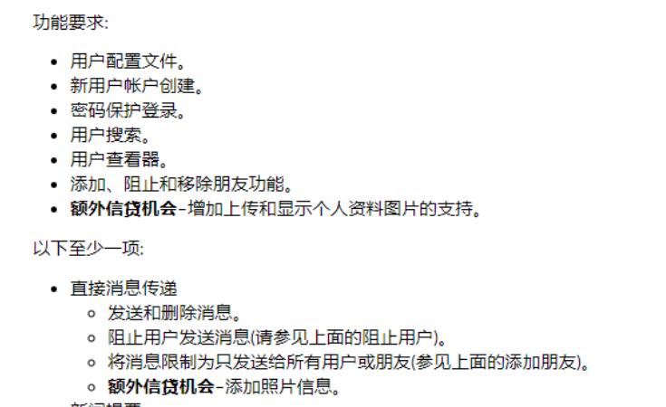

# CS-180-Team-Project
## Social Media Messaging App

## Instructions of compiling code:
1. download all the files in IDE.
2. javac (Document Name).
3. run the test cases.
## Student Submissions:
1. Abhiru Palhan - submitted all files and documentation.

## Functionality
Our fully-functioning team project is centered around creating a social media app that mirrors SMS messaging.
We modeled our software around the app Discord, which allows gamers and other users to communicate online. Our program contains several classes and their correlated interfaces and JUnit tests. Our program allows users to create accounts, saving their login information, send and receive messages, and perform other user functions

Functionality objectives:
- User profiles.
- New user account creation.
- Password protected login.
- User search.
- User viewer.
- Add, block, and remove friend features.

Additional features:
- Send and delete messages.
- Block users from sending messages.
- Restrict messages to either all users or friends only.

## Classes:
### Database.java
### Description:
The Database class is a key part of our messaging software.  Here, we create an array which stores all the users and provides multiple user functions, such as adding/removing friends.
### Functionality:
- **User Storage:** Stores users in an ArrayList, read from an input file
- **Message Handling:** Adds new messages to the user's profile
- **Friends Managing:** Methods, including '**addFriend**', '**removeFriend**', '**blockFriend**', handle operations when the user wants to change relationships with other users
- **User Searching:** Methods allow user to search and view their friends and their corresponding details
- **Writing User:** Writes user data to the User text file
### Testing:
- We've created a JUnit Test **DatabaseTest.java**, which tests several of the methods in **Database.java**, including testing for searching a user, writing a user, and adding new messages. Using these test cases, we have ensured the **Database.java** to be fully operational.
### Relationships to Other Classes:
- **Database.java** interacts with **User.java** as it performs user functions.

### LoginSystem.java
### Description:
The LoginSystem class is a key part of our messaging software.  Here, we prompt the user to sign up by creating a user with a username and password which is then stored in a file that is part of the database class
The sign-up process ensures the user creates a safe password and types in the correct credentials when logging in
### Functionality:
- **Sign-up:** User is prompted to create an account with a password that includes a special character and a username that hasn't been used already
- **Log in:** User has to enter their account credentials correctly or they will receive an error message indicating that they entered the wrong password or username
- **Protected Password:** Checks to see if during the sign-up process the user uses a special character in their password. If not, they will receive an error saying it is an invalid password
- **Existence of User:** Checks to see if the username has already been used. If the username has been used, the program will tell the user that the user already exists
- **User Credentials Storage:** Writes user credentials to a User text file
### Testing:
- We've created a JUnit Test **LoginSystemTest.java**, which tests several of the methods in **LoginSystem.java**, including testing for searching a user, writing a user, adding new users, and making sure the password is protected by using a special character. Using these test cases, we have ensured the **LoginSystem.java** to be fully operational.
### Relationships to Other Classes:
- **LoginSystem.java** interacts with **Database.java** as it performs database functions such as writing users, reading users, and checking if a user already exists.

### User.java
### Description:
The User class is a key part of our messaging software.  Here, we create array lists that store the messages, friends, and blocked friends of a user.
### Functionality:
- **Storage:** Stores friends and messages in ArrayLists, read from input files
- **Message Handling:** Adds and shows messages from the messages list from the database with getMessages and setMessages.
- **Friends Managing:** Adds and shows friends and blocked friends lists from the database with getFriends,setFriends,getBlockedFriends, and setFriends methods.

### Testing:
- We've created a JUnit Test **UserTest.java**, which tests several of the methods in **User.java**, including testing for adding friends, blocking friends, and adding new messages. Using these test cases, we have ensured the **User.java** to be fully operational.
### Relationships to Other Classes:
- **User.java** interacts with **Database.java** as it performs user functions such as adding friends, blocking friends, and sending messages.
